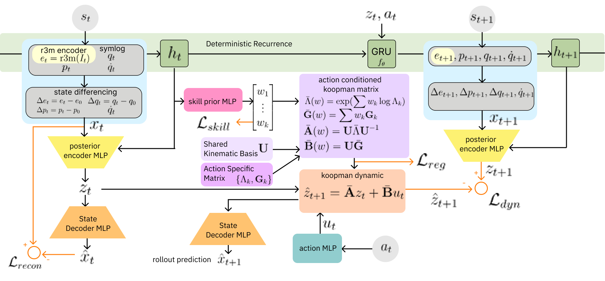

# KODAQ: Koopman-Augmented Dynamics for Skill-Aware Q-Learning

> **Skill-conditioned world model for offline RL via Koopman operator theory**

KODAQ is a hierarchical offline reinforcement learning framework that learns a **skill-conditioned Koopman world model** from offline demonstrations (D4RL Franka Kitchen), uses **LQR in the Koopman latent space** to generate model-based trajectories, and augments the offline dataset for **Q-learning-based policy optimization**.

---

## Architecture: KODAQ RSSM-Koopman



KODAQ extends the Recurrent State Space Model (RSSM) with a structured **Koopman dynamic prior** that enforces linear dynamics in a learned latent space, conditioned on discrete skill labels extracted via [EXTRACT](https://arxiv.org/abs/2306.02978).

### 1. Input Representation

Raw D4RL Kitchen observations ($s_t \in \mathbb{R}^{60}$) are transformed into a structured input vector:

$$x_t = [\underbrace{\Delta e_t}_{\text{R3M diff (2048)}},\ \underbrace{\Delta p_t}_{\text{obj. state diff (42)}},\ \underbrace{\Delta q_t}_{\text{qpos diff (9)}},\ \underbrace{\dot{q}_t}_{\text{qvel (9)}}] \in \mathbb{R}^{2108}$$

where all differences are **episode-first** ($\Delta(\cdot)_t = (\cdot)_t - (\cdot)_0$), removing layout-specific bias across episodes.

### 2. Model Components

| Module | Role |
|---|---|
| **Posterior Encoder** $\mu_\phi(x_t, h_t)$ | Maps $(x_t, h_t)$ ??latent state $z_t \in \mathbb{R}^{d_o}$ |
| **GRU Recurrence** $f_\theta$ | $h_{t+1} = \text{GRU}(h_t, z_t, a_t)$ ??encodes temporal history |
| **Skill Prior MLP** | $p_\theta(c_t \mid h_t) = \text{Cat}(\text{softmax}(W_c h_t))$ ??discrete skill weights $w_k$ |
| **Action Encoder** $\psi_\theta$ | $u_t = \psi_\theta(a_t) \in \mathbb{R}^{d_u}$ ??nonlinear action encoding |
| **Skill-Koopman Operator** | $\hat{z}_{t+1} = \bar{A}(w)\, z_t + \bar{B}(w)\, u_t$ |
| **State Decoder** | $\hat{x}_t = D_{\theta(z_t)}$ ??4 independent MLP heads |

### 3. Skill-Conditioned Koopman Dynamics

The core innovation is the **action-conditioned Koopman matrix**, interpolated in log-eigenvalue space across $K$ learned skill components:

$$\bar{\Lambda}(w) = \exp\!\left(\sum_k w_k \log \Lambda_k\right), \qquad \bar{A}(w) = U\,\bar{\Lambda}(w)\,U^{-1}$$
$$\bar{B}(w) = U\!\left(\sum_k w_k G_k\right)$$

- $U \in \mathbb{R}^{m \times m}$: **shared kinematic basis** across all skills (Assumption 2)
- $\Lambda_k = \text{diag}(\tanh(r_k^{(i)}) \cdot e^{i\theta_k^{(i)}})$: skill-specific eigenvalues ??$|\lambda_k^{(i)}| \leq 1$ guaranteed (stability)
- $G_k \in \mathbb{R}^{m \times d_u}$: skill-specific input coupling

Log-space interpolation guarantees $|\bar{\lambda}_i| \leq 1$ whenever all $|\lambda_k^{(i)}| \leq 1$, ensuring a **stable world model** by construction.

### 4. Training Objective

$$\mathcal{L} = \mathcal{L}_\text{rec} + \lambda_1 \mathcal{L}_\text{dyn} + \lambda_2 \mathcal{L}_\text{skill} + \lambda_3 \mathcal{L}_\text{reg}$$

| Loss | Formula | Purpose |
|---|---|---|
| $\mathcal{L}_\text{rec}$ | $\sum_j \alpha_j \|\hat{x}^{(j)}_t - x^{(j)}_t\|^2$ | 4-head reconstruction (?e, ?p, ?q, q?) |
| $\mathcal{L}_\text{dyn}$ | $\|\mu_\phi(x_{t+1}, h_{t+1}) - (\bar{A}z_t + \bar{B}u_t)\|^2$ | Koopman consistency ??L2, not KL (avoids posterior collapse) |
| $\mathcal{L}_\text{skill}$ | $-\log p_\theta(c_t = \hat{c}_t \mid h_t)$ | Cross-entropy vs. EXTRACT labels |
| $\mathcal{L}_\text{reg}$ | $\|\mu_\phi(x_t, h_t) - \text{sg}(\bar{A}z_{t-1} + \bar{B}u_{t-1})\|^2$ | Posterior-prior alignment (stop-gradient) |

**Three-phase training protocol:**

| Phase | Active Losses | Epochs | Purpose |
|---|---|---|---|
| 1 ??Warm-up | $\mathcal{L}_\text{rec}$ | 1??9 | Encoder/decoder convergence |
| 2 ??Koopman | $+ \mathcal{L}_\text{dyn} + \mathcal{L}_\text{skill}$ | 30??9 | Linear dynamics structure |
| 3 ??Full | $+ \mathcal{L}_\text{reg}$ | 80??00 | Posterior-prior alignment |

---

## Implementation Details

### Skill Labeling (EXTRACT Pipeline)

Skill labels $\hat{c}_t$ are extracted from offline demonstrations via an EXTRACT-compatible pipeline:

1. **R3M Rendering**: `MUJOCO_GL=egl` action replay ??`render_frame()` ??ResNet50 (R3M) ??2048-dim embeddings, cached as `r3m_embeddings.npz`
2. **Episode-first differencing**: $\Delta e_t = \text{R3M}(s_t) - \text{R3M}(s_0)$
3. **PCA + K-means** ($K=7$, `pca_dim=128`): clusters in R3M diff space
4. **Median filter** (window=7): smoothing per episode
5. **Segment splitting**: EXTRACT `SkillClusterD4RLSequenceSplitDataset` logic ??split at terminal OR skill-label change

```bash
python data/extract_skill_label.py \
    --r3m --env kitchen-mixed-v0 \
    --K 7 --pca_dim 128 \
    --out checkpoints/skill_pretrain/cluster_data.h5
```

### KODAQ Model

```python
# models/koopman_cvae.py
model = KoopmanCVAE(cfg)   # cfg: KoopmanCVAEConfig
# Key dimensions: x_dim=2108, koopman_dim=128, gru_hidden=256, num_skills=7

# Forward pass
out = model(x_batch, actions, skill_labels)
# Returns: z_seq, h_seq, skill_logits, recon, loss_*

# Encode sequence for planning
enc = model.encode_sequence(x_cond, a_cond)
# Returns: o_seq (B,T,m), h_seq (B,T,d_h), w_seq (B,T,K)
```

All loss computation is delegated to `models/losses.py` (pure functions, no `nn.Module` state), maintaining strict separation of concerns.

---

## LQR in Koopman Latent Space

Given a goal observation $x_\text{goal}$, KODAQ plans an optimal latent trajectory using **Discrete Algebraic Riccati Equation (DARE)**-based LQR directly in the Koopman space $\mathbb{R}^{d_o}$.

### Optimal Control Derivation

The LQR cost over the Koopman dynamics is:
 
$$J = \sum_{t=0}^{H} \left[(z_t - z^*)^\top Q (z_t - z^*) + u_t^\top R u_t\right]$$
 
Solving the Bellman equation without assuming $z^*$ is an equilibrium point yields:
 
$$u_t^* = \underbrace{(R + \bar{B}^\top P \bar{B})^{-1} \bar{B}^\top P}_{M} z^* - \underbrace{(R + \bar{B}^\top P \bar{B})^{-1} \bar{B}^\top P \bar{A}}_{L} z_t = M z^* - L z_t$$

where $P$ satisfies the DARE:

$$P = \bar{A}^{\top} P \bar{A} - \bar{A}^{\top} P \bar{B}(R + \bar{B}^{\top} P \bar{B})^{-1} \bar{B}^{\top} P \bar{A} + Q$$

Note that $L = M\bar{A}$: the feedforward gain $M$ and feedback gain $L$ differ exactly by one application of $\bar{A}$. This form is more general than $u_t^{*} = -L(z_t - z^{*})$, which only holds when $z^{*}$ is a true equilibrium ($\bar{A}z^{*} = z^{*}$). Since the Koopman latent $z^{*}$ of a manipulation goal is not guaranteed to be an equilibrium, the $Mz^{*} - Lz_t$ form is used throughout.

### Hybrid Skill-Adaptive Planning

At each step, $\bar{A}(w_t)$ and $\bar{B}(w_t)$ are blended from the current skill weights $w_t = \text{softmax}(W_c h_t)$. DARE is solved once on the **blended** $(\bar{A}, \bar{B})$ ??not on per-skill $(A_k, B_k)$ separately ??ensuring gain-dynamics consistency.

**Hybrid replan rule:**

$$\text{replan if } \|\bar{A}(w_{t+1}) - \bar{A}(w_t)\|_F > \varepsilon_A \quad \text{or} \quad t \bmod T_\text{replan} = 0$$

Goal $z^{*} = \mu_\phi(x_\text{goal}, h_t)$ is also re-encoded at each replan step (Option C), so the goal representation adapts to the evolving hidden state.

### Sequential Sub-Goal Planning

Task completion points are identified from **reward jump timesteps** in the offline dataset: $\text{rew}[t] > \text{rew}[t-1]$ signals task completion at $t$. Each reward jump defines a sub-goal:

```
Stage 0:  t=0     ??t_jump[0]    goal = obs[t_jump[0]]
Stage 1:  t_jump[0] ??t_jump[1]  goal = obs[t_jump[1]]
...
Stage N:  t_jump[-1] ??t_ep_end  goal = obs[t_ep_end]
```

Each stage runs an independent LQR plan with **dynamic horizon** equal to the actual stage length (minimum 16 steps), and results are concatenated into a full episode trajectory.

```python
# lqr_planner.py
planner = KODAQLQRPlanner(model, LQRConfig(Q_scale=1.0, R_scale=10.0))
results = run_lqr_on_episodes(planner, episodes, x_seq_full,
                               cond_len=16, unc_real_len=8)
# results[i]['full_o_traj']:  (T_total, m)  full Koopman trajectory
# results[i]['full_a_traj']:  (T_total, da) decoded robot actions
# results[i]['stages']:       per-stage plan info
```

---

## Rollout Uncertainty Estimation

To assess the reliability of model-based trajectories for offline RL, KODAQ computes a **variance-based uncertainty penalty** over a family of mixed real?�model trajectories.

### Construction

For a given starting point $(z_0, h_0)$ and real action sequence $a_{0:K}$, define a set of $K+1$ trajectories:

$$\tau_d = \underbrace{z_0, \ldots, z_d}_{\text{real actions } a_{0:d}} \oplus \underbrace{z_{d+1}^{\text{LQR}}, \ldots, z_{d+H}^{\text{LQR}}}_{\text{LQR rollout}}, \quad d = 0, 1, \ldots, K$$

The per-timestep uncertainty is the variance across trajectories at the same time index:

$$\sigma^2_t = \text{Var}_d\!\left[z_t^{(\tau_d)}\right] = \frac{1}{|\mathcal{D}_t|}\sum_{d \in \mathcal{D}_t} \|z_t^{(\tau_d)} - \bar{z}_t\|^2, \quad \bar{z}_t = \text{mean}_d[z_t^{(\tau_d)}]$$

$$\mathcal{U} = \frac{1}{H}\sum_t \sigma^2_t$$

### Intuition

- **$d=0$**: pure LQR ??purely model-based, highest uncertainty in novel regions
- **$d=K$**: $K$ real steps + LQR suffix ??grounded in real data, lower uncertainty near demonstrated states
- **High $\sigma^2_t$**: trajectories diverge ??model is extrapolating beyond the data distribution ??penalize

This uncertainty is used to construct a **penalized reward** for offline Q-learning:

$$r_\text{penalized}(z_t, u_t) = r(z_t, u_t) - \lambda \cdot \mathcal{U}$$

---

## Downstream: Offline RL with Data Augmentation

The LQR trajectories and uncertainty estimates from KODAQ feed directly into an offline RL pipeline.

### Data Augmentation

For each offline episode, KODAQ generates:
- **Model-based trajectories** $\{(z_t, u_t, \hat{z}_{t+1}, r_t)\}$ in Koopman space via sequential LQR
- **Uncertainty-penalized rewards** $r_\text{penalized} = r - \lambda \mathcal{U}$
- **Decoded robot actions** $\hat{a}_t = \psi_\theta^{-1}(u_t^{*})$ via gradient-based inversion of the action encoder

These augmented transitions are mixed with the original offline dataset to expand state-action coverage while penalizing out-of-distribution regions.

### Q-Learning in Koopman Space

The augmented dataset enables offline Q-learning (e.g., IQL, CQL, COMBO) directly in the Koopman latent space, with several advantages:

- **Linear dynamics prior**: the Koopman structure constrains the world model, reducing Bellman backup error
- **Skill-conditioned value**: the Q-function can condition on skill weights $w_t$ for multi-task generalization
- **Conservative augmentation**: uncertainty penalty $\lambda \mathcal{U}$ discourages exploitation of inaccurate model regions, similar in spirit to COMBO's model-based conservatism

The resulting policy $\pi(u_t \mid z_t, h_t)$ operates in the Koopman latent space and is decoded to robot actions via $\hat{a}_t = \psi_\theta^{-1}(u_t)$.

---

## Installation & Usage

### Requirements

```bash
conda create -n koopman_d4rl python=3.8
conda activate koopman_d4rl

pip install torch torchvision
pip install git+https://github.com/Farama-Foundation/d4rl.git
pip install git+https://github.com/facebookresearch/r3m.git
pip install h5py scipy scikit-learn matplotlib
```

### Directory Structure

```
koopman_CVAE/
?��??� models/
??  ?��??� koopman_cvae.py     # KODAQ RSSM-Koopman model
??  ?��??� losses.py           # All loss functions (pure functions)
?��??� data/
??  ?��??� extract_skill_label.py   # EXTRACT pipeline + x_t construction
??  ?��??� dataset_utils.py         # KODAQWindowDataset
?��??� envs/
??  ?��??� env_configs.py      # Environment-specific hyperparameters
?��??� train.py                # KODAQ training script
?��??� lqr_planner.py          # LQR planning + uncertainty estimation
```

### Step 1: Skill Labeling

```bash
# R3M rendering + K-means skill labeling (caches r3m_embeddings.npz)
MUJOCO_GL=egl python data/extract_skill_label.py \
    --r3m --env kitchen-mixed-v0 \
    --K 7 --pca_dim 128 \
    --out checkpoints/skill_pretrain/cluster_data.h5 \
    --device cuda
```

### Step 2: Train KODAQ World Model

```bash
python train.py \
    --env kitchen_mixed \
    --seq_len 64 --batch_size 32 --epochs 200 \
    --phase2_epoch 30 --phase3_epoch 80 \
    --num_skills 7 \
    --skill_dir checkpoints/skill_pretrain \
    --save_dir checkpoints/kodaq \
    --device cuda
```

### Step 3: LQR Planning & Trajectory Generation

```bash
python lqr_planner.py \
    --ckpt  checkpoints/kodaq/final.pt \
    --x_cache checkpoints/skill_pretrain/x_sequences.npz \
    --quality mixed --n_ep 100 \
    --cond_len 16 --unc_len 8 \
    --Q_scale 1.0 --R_scale 10.0 --lambda_unc 0.1 \
    --out_dir checkpoints/kodaq/lqr \
    --device cuda
```

### Step 4: Offline RL (Q-learning with Augmented Data)

*Coming soon ??IQL/COMBO integration using KODAQ-augmented transitions.*

---

## Citation

```bibtex
@misc{kodaq2025,
  title   = {KODAQ: Koopman-Augmented Dynamics for Skill-Aware Q-Learning},
  author  = {Yang, Junwon},
  year    = {2025},
  note    = {Work in progress}
}
```

---

## References

- EXTRACT: Extracting Skill-Based Offline Reinforcement Learning, CoRL 2024
- R3M: A Universal Visual Representation for Robot Manipulation, CoRL 2022
- COMBO: Conservative Offline Model-Based Policy Optimization, NeurIPS 2021
- Koopman Q-Learning: Offline Reinforcement Learning via Symmetries of Dynamics, ICML 2022


